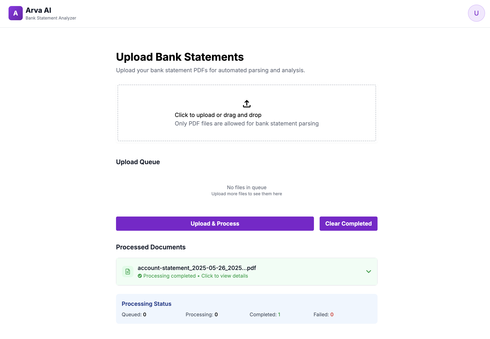
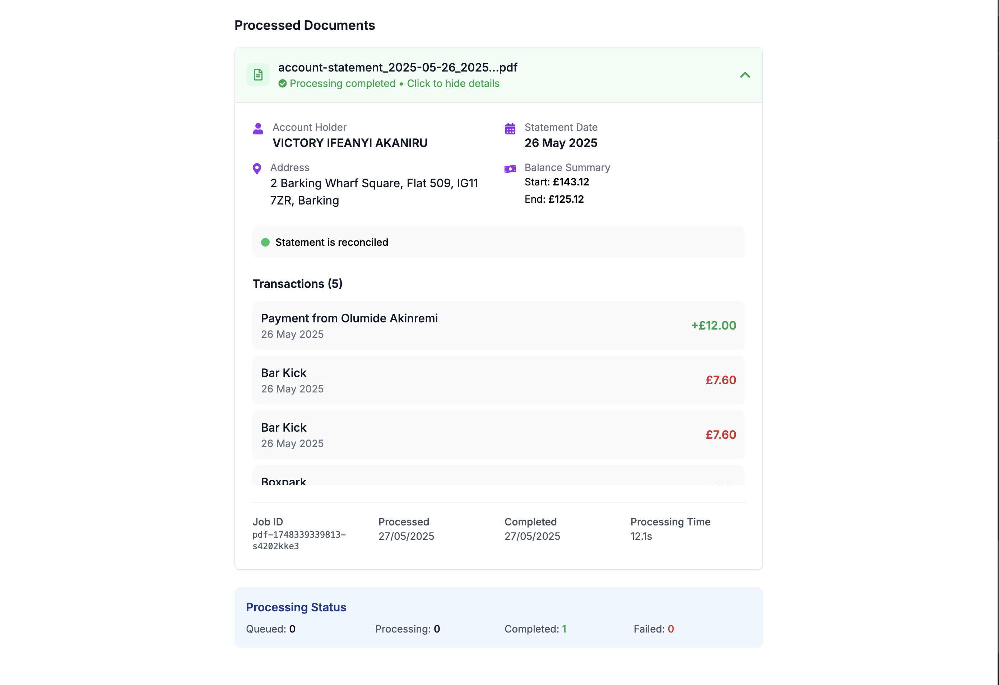

# LedgerLens

LedgerLens is an AI-assisted bank statement processing app built to extract, structure, and review information from PDF bank statements through a clean full-stack workflow.

It combines a Next.js frontend with a NestJS backend, background job processing, PDF parsing, and LLM-assisted extraction so uploaded statements can be processed asynchronously and surfaced in a usable interface.

## Why this project exists

Bank statements are messy, inconsistent, and still heavily PDF-based. The point of this project is to turn those documents into something easier to process programmatically without forcing the user through manual extraction.

This project focuses on practical document-processing workflow design:
- upload PDFs through a simple UI
- queue processing in the background
- extract and structure statement content
- surface results with job status and document-level feedback

## Stack

### Frontend
- Next.js
- React
- TypeScript
- Tailwind CSS

### Backend
- NestJS
- TypeScript
- Bull / background jobs
- Redis
- PDF parsing
- OpenAI

## Architecture

### Frontend
The frontend handles:
- PDF uploads
- upload queue state
- polling for processing status
- processed document results
- failed/completed job visibility

### Backend
The backend handles:
- PDF upload endpoints
- validation and queueing
- asynchronous document processing
- PDF parsing and extraction
- LLM-assisted structuring
- Swagger docs and queue monitoring

## Local setup

### Prerequisites
- Node.js 18+
- npm
- Redis
- OpenAI API key

## Backend setup
```bash
cd backend
npm install
npm run start:dev
```

## Frontend setup
```bash
cd frontend
npm install
npm run dev
```

## Environment
Backend expects values like:

```bash
OPENAI_API_KEY=your_openai_api_key
REDIS_URL=redis://localhost:6379
LLM_PROVIDER=openai
```

## Project structure

```text
backend/
  src/
    modules/
      llm/
      pdf-parser/
    common/

frontend/
  src/
    app/
    components/
    services/
    lib/
```

## Screenshots

### Empty upload state


### Results view


## What’s solid here
- clear separation between frontend and backend
- async processing instead of blocking uploads
- queue-backed document workflow
- usable UI for upload + status + results
- good base for production-hardening

## What I’d improve next
- stronger extraction accuracy and validation
- better normalization of parsed transactions
- richer result views and export options
- improved observability around parsing failures
- authentication and audit trail if used in a real business setting
- better test coverage across upload and processing flows

## Good GitHub framing
LedgerLens is best presented as:
- an AI-assisted document processing app
- a bank statement parsing workflow system
- a practical full-stack project showing frontend, backend, queues, PDFs, and LLM integration
